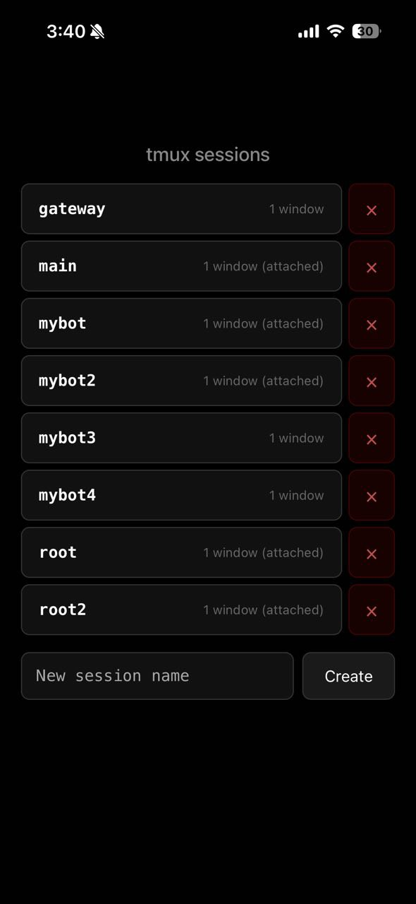
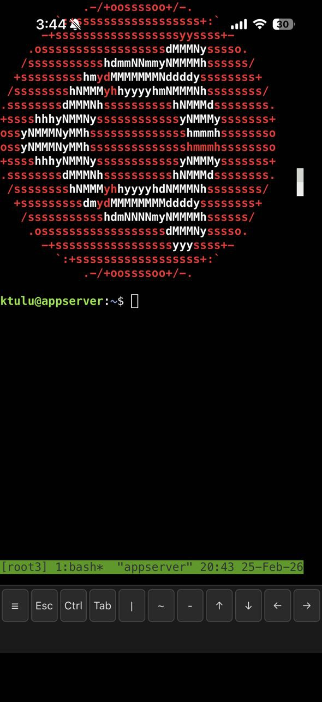
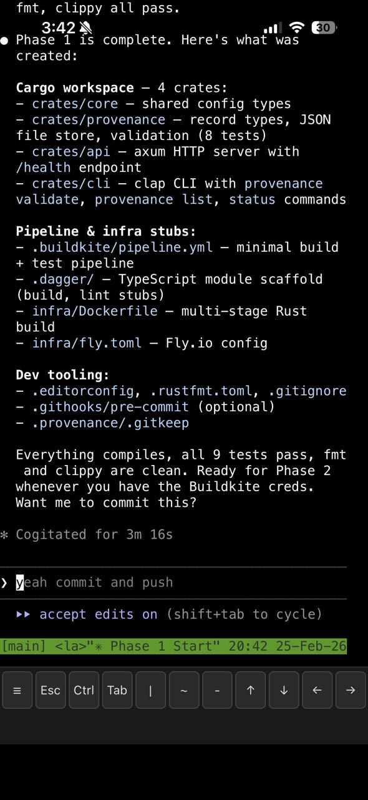

# tmux-wrapper

Single-binary web tmux terminal, fronted by Cloudflare Access.

The auth is the tunnel. The binary just runs tmux.

<p align="center">
  
  
  
</p>

```
browser ─► permutations cloudflare ─► your host (127.0.0.1:7681) ─► tmuxwrapper ─► tmux
            ↑                              ↑
            TLS terminates here            JWT verified here
            CF Access enforces who         (JWKS cached, refreshed periodically)
```

## Why this exists

The first version of this had two auth modes (local password + Cloudflare Access), a voice-output experiment, and shipped as Docker. The auth surface and TLS story were confusing. This one trims it to one path:

- **One auth mode:** Cloudflare Access. JWT in `Cf-Access-Jwt-Assertion`, verified against your team's JWKS. If the request reaches the binary, it's already authenticated. There is no password fallback in the code — not disabled, gone.
- **One transport:** the binary binds `127.0.0.1:7681`. TLS isn't its problem — Cloudflare terminates it, the tunnel carries plain HTTP from the edge to your box.
- **One artifact:** a Rust binary + a `config.toml` + a systemd unit. No Docker.

If you need local password auth or self-hosted TLS, this isn't the project for you.

## Features

- **Cloudflare Access auth** — JWT verified against your team's JWKS (cached, periodic refresh; failed fetches retry with backoff so a blip at boot doesn't lock everyone out)
- **Email → unix user** — the email in the access JWT maps to a real account on the box, isolated per user via setuid
- **Tmux per user** — every session attaches to a named tmux session as the target unix user
- **Session caps** — at most 5 WebSocket connections per user, and a configurable cap on distinct tmux sessions (`max_sessions_per_user`, default 5). Creating a session past the cap is refused with a visible message; attaching to an existing one always works
- **Systemd-managed** — capability-bounded service; sessions are saved on stop via tmux-resurrect if it's installed, silently skipped if not
- **PWA-ready** — installable on iOS/Android, touch-friendly key bar, dictation support

## Quickstart

```bash
git clone https://github.com/devPermutations/tmux-wrapper.git
cd tmux-wrapper
cargo build --release
./deploy.sh
```

That installs the binary to `/opt/tmuxwrapper/`, copies static assets, and registers the systemd unit. Before starting, edit the config:

```bash
sudo nano /opt/tmuxwrapper/config.toml
```

Set `cloudflare.audience` to your CF Access AUD tag (see [Cloudflare Access setup](#cloudflare-access-setup) below), then:

```bash
sudo systemctl start tmuxwrapper
sudo systemctl status tmuxwrapper
```

Point your CF Access app at the host and visit it from any browser.

## Configuration

`config.toml`:

```toml
listen = "127.0.0.1:7681"
static_dir = "./static"

[cloudflare]
team_domain = "yourteam"                          # https://yourteam.cloudflareaccess.com
audience = "REPLACE_WITH_CF_ACCESS_AUD_TAG"       # from your CF Access app
jwks_refresh_secs = 3600

[terminal]
ping_interval_secs = 30
max_sessions_per_user = 5    # tmux sessions per user; attach is always allowed

[[users]]
email = "you@example.com"
unix_user = "youruser"
tmux_session = "main"
```

Add one `[[users]]` block per allowed user. Emails not in the list are rejected even if their Cloudflare JWT is valid.

## Cloudflare Access setup

1. Cloudflare dashboard → **Zero Trust** → **Access** → **Applications** → **Add an application** → **Self-hosted**.
2. Set the application domain to the hostname that will reach your tunnel (e.g. `term.example.com`).
3. Add an Access policy with the email(s) you'll list in `config.toml`.
4. After creating the application, open it and copy the **Application Audience (AUD) Tag**. That's the `audience` value.
5. Set your `team_domain` to the subdomain in your team URL (`https://<team_domain>.cloudflareaccess.com`).

Tunnel the application hostname (`term.example.com`) to `http://127.0.0.1:7681` on your host using `cloudflared` or a sidecar tunnel.

## What runs as root

The binary runs as `root` to `setuid` into the target unix user before spawning the PTY. The systemd unit uses:

```
CapabilityBoundingSet=CAP_SETUID CAP_SETGID CAP_DAC_OVERRIDE CAP_FOWNER
ProtectSystem=strict
ProtectKernelTunables=yes
ProtectKernelModules=yes
ProtectControlGroups=yes
RestrictNamespaces=yes
```

`NoNewPrivileges=no` is required for the setuid path to work. Everything else is locked down.

## Status

This is the code I run on my own server. It's stable enough for that. No guarantees beyond that — issues and PRs welcome but no SLA.

## License

MIT
